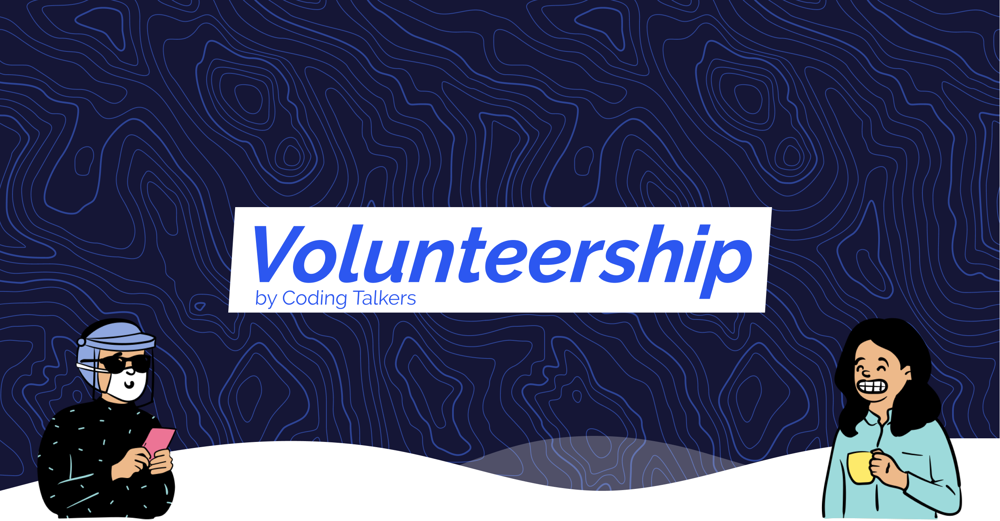

# Volunteership Resources

### What you'll find

Collection of resources to help volunteers all the way through the Volunteership roadmap and more!

## Volunteership courses

-   [Learning Figma Basics :black_nib: ]
-   [HTML and CSS Basics :computer: ]
-   [Introduction to git :card_index_dividers: ]
-   [What the heck is kanban? :coffee: ]
-   [How to talk to a client :massage_man: ]
-   [Deep dive into UX :paintbrush: ]
-   [Javascript story tales :notebook: ]
-   [Responsive layout with flexbox :iphone: ]
