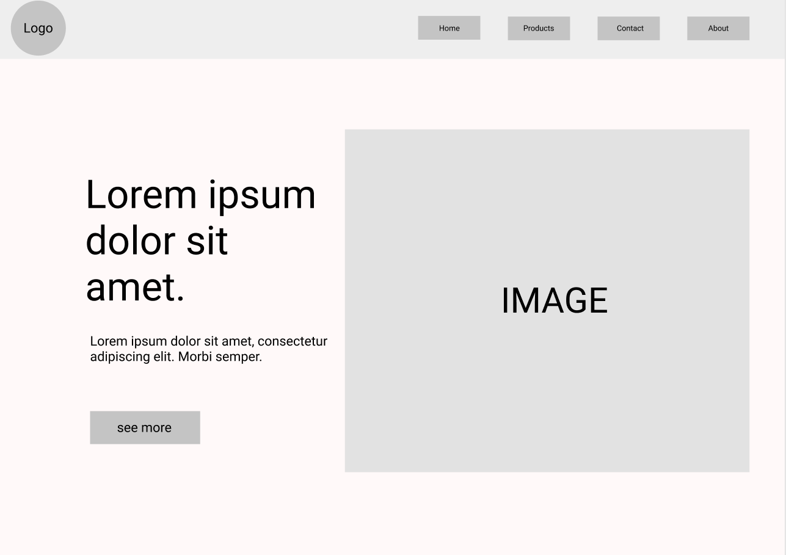
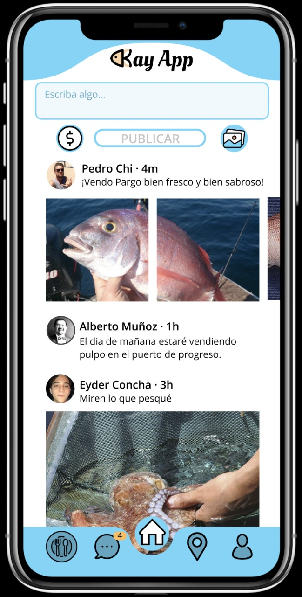
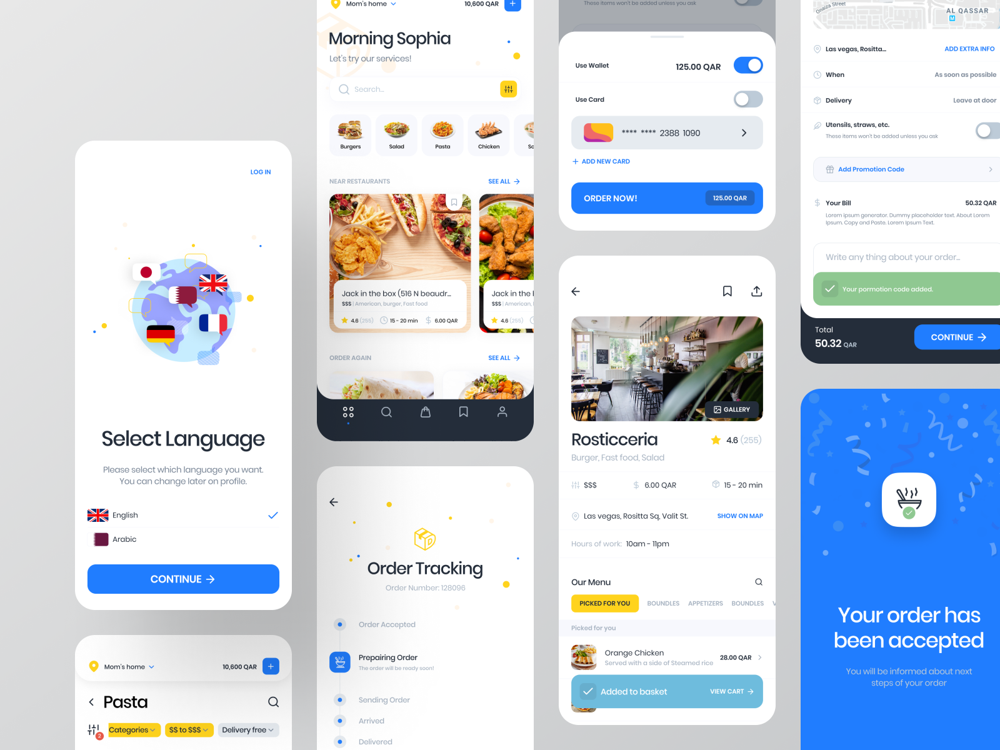

## Low fidelity mockups :pencil2:

This design is not interactive that much, they lack of visuals and colors, only provides the general architecture of the product.

This type of mockup are really similar to a wireframe, they share the same goal, complexity and benefits.

## Mid fidelity mockups :crayon:

Medium fidelity wireframes can help to communicate to teams how aesthetic features can support essential functionalities.

While medium fidelity wireframes can still be created manually, using digital tools to create more detailed and realistic UI components can also be meaningful for understanding how some aesthetic details could merge with essential functionalities.

## High fidelity mockups :fountain_pen:

There's a gray line between a high and mid fidelity wireframes.

High fidelity wireframes take more effort to create, but they are effective in that they reveal how a product will look at project completion.
High fidelity wireframes are created solely with digital tools.

The core difference from the other types of wireframes is that high fidelity wireframes are built in with color and present screens that are closer to how they would appear in final version of the software.

## [Previous](https://github.com/Coding-Talkers/volunteer-resources/blob/master/courses/Figma-Basics/5.wireframe.md)

## [Next](https://github.com/Coding-Talkers/volunteer-resources/blob/master/courses/Figma-Basics/7.figmaBasics.md)
