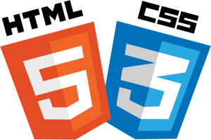

# HTML and CSS Basics :computer:

    

## Description :paperclip:

This section will contain the basics of html and css so you can start building awesome websites and bringing designs to life.

It will also be added some tools and additional info to develop html and css.

## imreyesjorge :bearded_person:

In here you can find imreyesjorge github repository explaining about the basics of html and css.

-   [Repository](https://github.com/imreyesjorge/HTMLyCSS/)
-   [Website](https://imreyesjorge.github.io/HTMLyCSS/)

## Development Tools :toolbox:

### Codepen :pen:

CodePen is an online community for testing and showcasing user-created HTML, CSS and JavaScript code snippets. It functions as an online code editor and open-source learning environment, where developers can create code snippets, called "pens," and test them.

**Link:** https://codepen.io/

### Visual Studio Code

Visual Studio Code is a free source-code editor made by Microsoft for Windows, Linux and macOS.

Visual studio code has a lot of plugins useful to develop amazing websites. Here's a list of some of them and all can be downloaded from the visual studio code extension section.

-   Prettier: Prettier is an opinionated code formatter. It enforces a consistent style by parsing your code and re-printing it with its own rules that take the maximum line length into account, wrapping code when necessary.

-   Live server: Launch a development local server with live reload feature for static and dynamic pages.

-   GitLens: GitLens supercharges the Git capabilities built into Visual Studio Code. It helps you to visualize code authorship at a glance via Git blame annotations and code lens, seamlessly navigate and explore Git repositories, gain valuable insights via powerful comparison commands, and so much more.

-   TabNine: Code autocompleter tool that predicts the rest of the code programmers are typing — much like word or phrase autocomplete in a Google search window.

## Articles :paperclip:

-   [HTML can do that?](https://dev.to/ananyaneogi/html-can-do-that-c0n): Contains codepen website examples.

-   [HTML page templates](https://dev.to/davidepacilio/40-free-html-landing-page-templates-3gfp): Contains 40 free landing page templates

-   [10 html elements you didn't know about](https://dev.to/emmabostian/10-html-element-you-didnt-know-you-needed-3jo4): today we’ll discover ten HTML elements you might not have known existed in the hopes that you can create more accessible, and structurally-sound web applications.

-   [Units in CSS](https://dev.to/matthias/units-in-css-em-rem-pt-px-vw-vh-vmin-vmax-ex-ch-53l0): CSS knows several measurement units. The best known unit is pixels, but there are other units that are not that popular but very handy in some uses cases.

## Youtube channels :video_camera:

-   [DesignCourse](https://www.youtube.com/user/DesignCourse)
-   [TraversyMedia](https://www.youtube.com/watch?v=X1dz0xRbSJc)
-   [freecodecamp](https://www.youtube.com/watch?v=pQN-pnXPaVg)

## Emmet cheat sheet

Here is a link with an emmet cheat sheet so you can write html faster:

https://docs.emmet.io/cheat-sheet/
